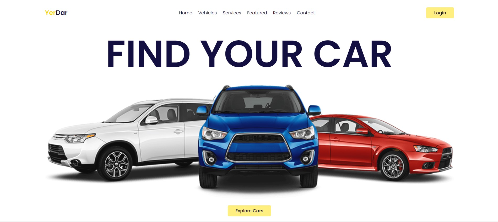

<!DOCTYPE html>
<html lang="en">
<head>
    <meta charset="UTF-8">
    <meta http-equiv="X-UA-Compatible" content="IE=edge">
    <meta name="viewport" content="width=device-width, initial-scale=1.0">
    <title>Document</title>
    <link rel="stylesheet" href="stylepres.css">
</head>
<body>
    

        
About us

        
Final Project

        
Technologies used

    

    

        

            
        

    
        

            
            <h2 style="padding-top: 10px;"><b>SAVE 10% WITH OUR FREE FLEET PROGRAM</b></h2>     
            
        

    

    
    
    

          
        

            

            <h1 style="padding-top: 10px;"><b>INVESTING IN</b></h1>
            <h1><b>PRODUCT</b></h1>
            <h1><b>INNOVATION</b></h1>
        

            
            
        

    
        

            
        

    
    

    

        
    

    

        <h1>Used Technologies</h1>
        
    

    

        <h1>The QR code to out website</h1>
        
    

  
  
</body>
</html>
